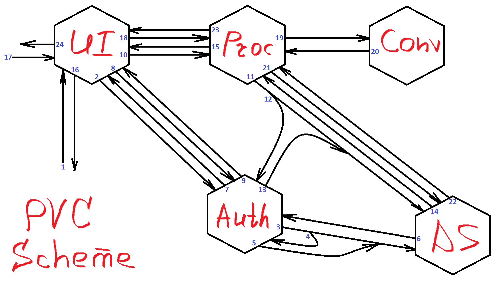

# PDF to Voice converter

    

Это учебный проект, целью которого является получение практических навыков работы со Spring Framework, 
проектирования и разработки много-компонентных систем, использования преимуществ микросервисной 
архитектуры.

## Описание

Данный файл описывает состав проекта, механизм взаимодейтсвия отдельных компонентов между собой 
без углубления в тонкости реализации. Дополнительно приведен список технологий, которые использовались 
при разработке.

## Состав

В общем и целом проект состоит из 5 компонентов:
1. UI - интерфейс пользователя
2. AuthServer - сервер аутентификации
3. DataStorage - система хранения
4. Converter - реализация компонента конвертирования текстовой информации в звуковую
5. Processor - связующее звено между UI, Converter и DataStorage

UI не является обязательным, т.к. при наличии определенных навыков пользователь  может 
самостоятельно авторазоваться в AuthServer, а после использовать полученную авторизацию для обращения к 
Processor напрямую.
Converter может быть использован отдельно от проекта, т.к. данный компонент не защищен с помощью технологии
Spring Security. Его API открыт для общего доступа.

## Схема

Для наглядности внутренние процессы проекта изображены на диаграмме с последующим разбором того, что 
происходит "под капотом", но протым языком и без перегрузки терминами. Так, например, обращение к UI 
(открытие старницы проекта в браузере, условная отправная точка) выполняется на первом шаге, а загрузка 
PDF файла для последующего конвертирования - только на семнадцатом. Указанная диаграмма должна дать общее
представление о том, как отдельные компоненты в микросервисной ахитектуре проекта взаимодействуют 
между собой, какие действия между ними выполняются шаг за шагом.

Пояснения, которые упростят последующее объяснение:  
- Ввиду наличия в данном проекте микросервиса AuthServer, выполняющего роль сервера авторизации по 
технологии OAuth2, все запросы (не важно, человек-микросервис или микросервис-микросервис) между 
защищенными компонентами системы (UI, Processor, AuthServer, DataStorage) должны содержать заголовок 
Authorization, в котором передается Access token. Адресат запроса проверяет у AuthServer действителен 
ли указанный токен, и какими правами обладает его предъявитель. Если токен действителен и прав 
предъявителя достаточно, то выполняется сценарий по умолчанию. В противном случае - адресант запроса 
перенаправляется для авторизации на AuthServer, либо ему отказывается в доступе (пункты 
3 и 11 разобраны отдельно и более подробно, потому что в них неявно для пользователя один микросервис 
авторизуется у другого).  
- Приведенная ниже схема иллюстрирует нормальный сценарий действий. Под словом "нормальный" в данном случае
понимается такой сценарий, который выполняается при отсутсвии каких-либо нешататных систуаций (перебои в 
соединении, недоступность сервера баз данных, "падение" микросервисов системы и т.д.).

1. Пользователь обращается к UI, например, с помощью браузера, чтобы через интерфейс отобразившейся 
страницы воспользоваться функциональными возможностями проекта - конвертировать PDF файл в MP3. Ввиду того, 
что указанное обращение было первым, заголовок Authorization пуст.
2. Происходит перенаправление пользователя на страницу авторизации, которая генерируется AuthServer, 
для получения (в случае успешной авторизации) Authorization code. Тут пользоватею предлагается ввести 
логин/пароль, либо зарегистрироваться в системе. Допустим, у пользователя уже есть регистрационные данные, 
которые он вводит.
3. AuthServer направляет запрос в DataStorage, чтобы проверить наличие введенных пользователем логина/пароля
в базе данных.
4. Выполняется проверка Access token микросервиса AuthServer. При первом обращении он пуст. AuthServer 
авторизует сам себя и выдает Access token. Отличие от сценария с обращением пользователя в том, что 
используется другой тип авторизации: в данном случае при успешной авторизации сразу выдается Access token.
5. AuthServer сообщает DataStorage, что Access token действителен, адресант имеет права на получение 
сведений о том, имеется ли в базе данных введенная пользователем пара логин/пароль.
6. DataStorage выполняет запрос и передает ответ AuthServer. Если введенные пользователем логин/пароль 
не найдены в базе данных, то на старнице авторизации отображается соответствующее сообщение.
7. Пара логин/пароль прошла проверку и найдена в базе данных. Браузеру пользователя передается 
Authorization code.
8. Браузер пользователя автоматически передает Authorization code обратно в AuthServer для обмена на 
Access token.
9. AuthServer взвращает в UI действительный Access token. На данном этапе авторизация пользователя в 
системе завершается. Указанный токен браузер будет передавать при каждом запросе в заголовке Authorization.
10. Бразуер пытается отобразить главную страницу сервиса. Однако помимо опции загрузить файл для 
конвертирования, на этой странице отображается список ранее конвертированных файлов (с возможностью 
скачать их). Для получения списка отправляется запрос к микросервису Processor. Успешное выполнение 
запроса возможно только для авторизованных пользователей: действителен ли Access token, проверяется у 
AuthServer.
11. Processor направляет запрос в DataStorage, чтобы получить список файлов, ранее конвертированных 
авторизованным пользователем.
12. Возникает ситуация, аналогичная той, что была разобрана в пункте 4. Выполняется проверка Access token 
микросервиса Processor. При первом обращении он пуст. AuthServer авторизует Processor и выдает Access token.
13. AuthServer сообщает DataStorage, что Access token действителен, адресант имеет права на получение
сведений о том, какие файлы ранее были конвертированы авторизованным пользователем.
14. DataStorage возвращает Processor спиоск файлов.
15. Processor возвращает UI список файлов.
16. UI формирует страницу, содержащую поле для загрузки PDF файлов для конвертирования, список ранее
конвертированных файлов (может быть пустым), сведения о логине авторизованного пользователя, а также 
ссылку для выхода из системы. Браузер отображает эту страницу.
17. Пользователь загружает PDF файл для конвертирования через соответствующее поле ввода на странице.
18. UI передает файл в Processor.
19. Processor передает файл в Converter.
20. Converter возвращает конвертированный файл в Processor.
21. Processor передает конвертированный файл в DataStorage для сохранения.
22. DataStorage сообщает Processor об успешном выполнении операции.
23. Processor сообщает UI об успешном выполнении операции.
24. Далее возникает ситуация, описанная в пунктах 10-16 с той разницей, что все микросервисы системы 
уже прошли авторизацию.

## Технологии

This is the internal microservice - the part of
[PDFReader](https://github.com/he1ex-tG/PDFReader) project.

## Structure

This module provides an [API](#1-api) for [converting](#2-converter) PDF files
or plain text to audio format.

### 1. API

The API is built using the features provided by
[Spring Boot](https://spring.io/projects/spring-boot). It provides some
endpoints that can be used by third party services:

| __Method__ | __Endpoint__ | __Description__                                                                                               |
|------------|--------------|---------------------------------------------------------------------------------------------------------------|
| GET        | /            | Get info                                                                                                      |
| GET        | /api/v1      | Get API info (e.g. request method, content type, incoming data format and data type that returns in response) |
| POST       | /api/v1/file | Convert `TransferData` object with content of PDF file to `TransferData` object with content of MP3           |
| POST       | /api/v1/text | Convert `TransferData` object with content of plain text to `TransferData` object with content of MP3         |

Content type of POST requests is `APPLICATION/JSON`. Request body is an instance of
`TransferData` class

    class TransferData(
      val content: ByteArray
    ) {
      val contentSize: Int
        get() = content.size
    }

where `content` filed is a PDF file or text in the form of `ByteArray` for file or text
conversion accordingly.

### 2. Converter

Converting a PDF file into text (array of bytes) is made using the
[ITextPDF](https://itextpdf.com/) library. Then the text is converted by
the [FreeTTS](https://freetts.sourceforge.io/) library.

> __Note__
>
> By default, FreeTTS does not provide the ability to
> output the audio stream as a `ByteArrayInputStream` or `ByteArray`, for example.
> So, I made my own implementation of the `AudioPlayer` interface.
> This approach makes it possible to avoid intermediate saving of
> audio data to a file, as well as to hot convert from WAV to MP3 using
> [Lame](https://lame.sourceforge.io/).

### 3. Exception handling

As mentioned above, ConverterAPI is an internal microservice, so it is assumed that the
correct data will be passed in the request body, i.e. not null `TransferData` object,
not blank `TransferData.content`, etc. However, errors may occur if `TransferData.content`
will contain a non-pdf file or empty string, for example. For such cases, exception handling
is provided by extending `ResponseEntityExceptionHandler` class, using of the
`@ControllerAdvice` and `@ExceptionHandler` annotations.

The entire list of `ITextPDF` module exceptions (`BadPasswordException`,
`IllegalPdfSyntaxException`, `InvalidPdfException`, `UnsupportedPdfException`) and one
custom exception (`TtsEmptyStringException`) are handled in the project.

As a result of exception handling, the corresponding `RequestEntity` object is generated
and sent to the consumer.

### 4. Tests

Functional tests of both the API and the converter are located in `./src/test`
directory.

## Build Instructions

To successfully build the project, you should first compile Lame yourself. After
compilation, it will be placed in the Maven local repository (included in the
`repositories` section in the `build.gradle.kts` file). Compilation instructions
and source codes can be found on the [Lame](https://lame.sourceforge.io/) website.

The project is built after the dependency issues are resolved. For example,

from command line (in project root directory)

    # ./gradlew bootJar

or manually run build task `bootJar` from IDE.

The compiled Jar is in `./build/libs/ConverterAPI-[version]-SNAPSHOT.jar`.

## Usage

Here:
- [host] is the host where the project is running, [host] = `localhost` by
  default.
- [port] is the port. It can be changed in the `application.yaml` settings
  file. [port] = `8082` by default.

Files conversion:

    # curl -X POST -H "Content-type: application/json" -d @C:/hw.txt -o C:/hw.dto http://[host]:[port]/api/v1/file

Text conversion:

File `hw.txt`

    {
      "content": [72, 101, 108, 108, 111, 32, 119, 111, 114, 108, 100, 33]
    }

Command

    # curl -X POST -H "Content-type: application/json" -d @C:/hw.txt -o C:/hw.dto http://[host]:[port]/api/v1/text

## TODO

- [x] Conversion process
    - [x] PDF file to text
    - [x] Text to audio format (WAV by default)
        - [x] WAV to MP3
        - [ ] Male/female voice choosing
- [x] REST API endpoints
    - [x] File conversion
    - [x] Text conversion

## Technologies Used:

1. [Spring Boot](https://spring.io/projects/spring-boot)
2. [ITextPDF](https://itextpdf.com/)
3. [FreeTTS](https://freetts.sourceforge.io/)
4. [Lame](https://lame.sourceforge.io/)
